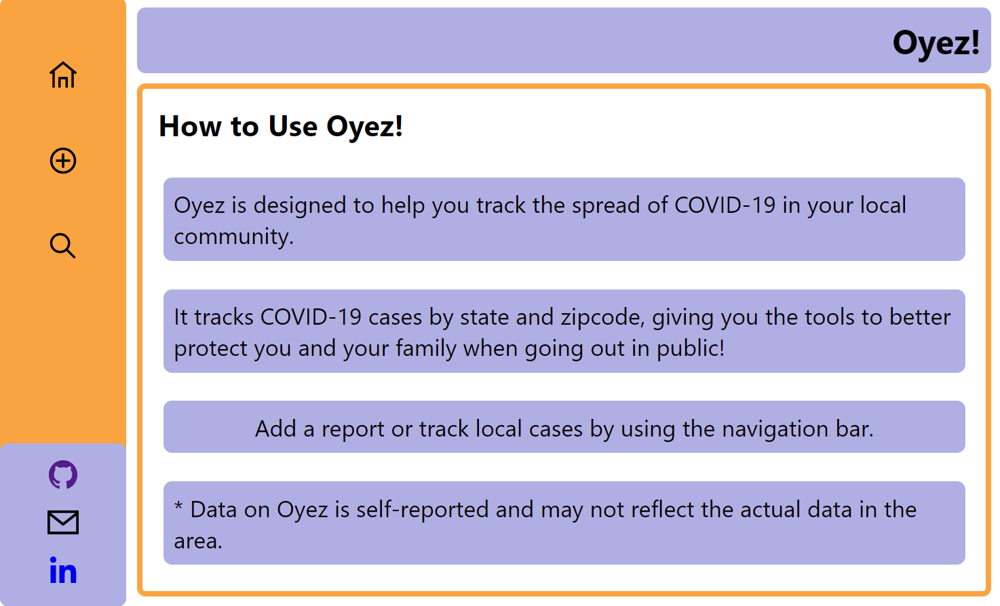
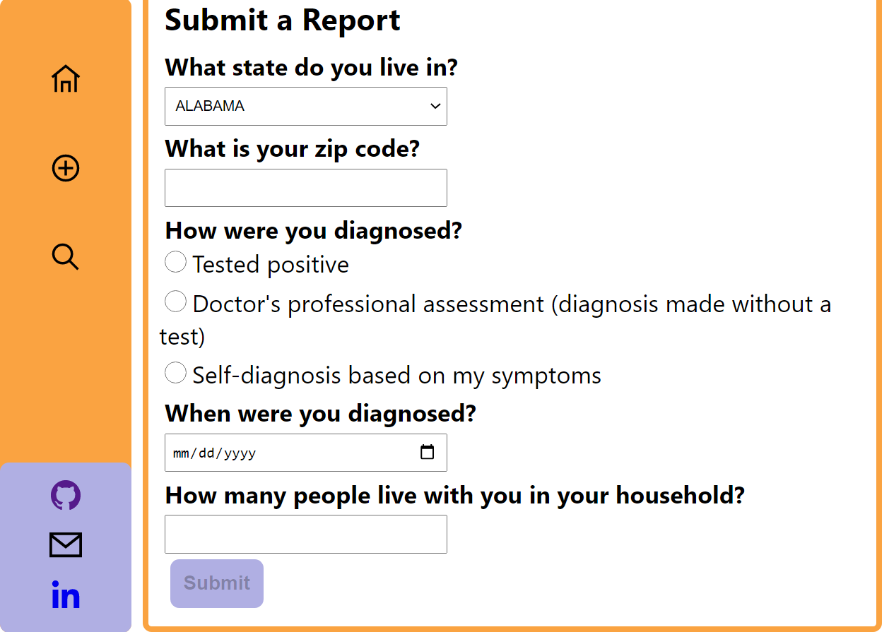
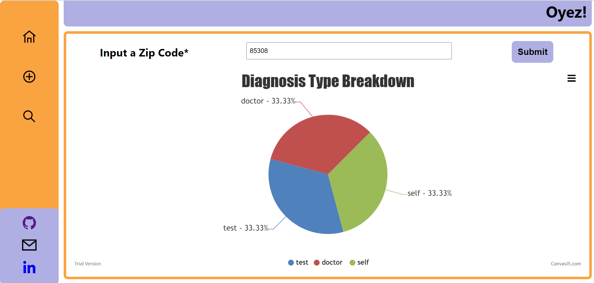
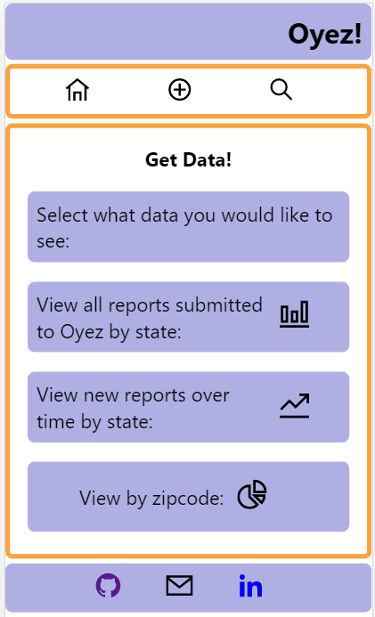

# **Oyez!**

https://oyez-client.vercel.app/

## Description:
A full-stack React app that allows individuals to self-report cases of COVID-19 and view recorded instances by geographical location. App will be limited to recording data from people who live in the United States (future versions of the app could expand to include other countries).

## Technology used:
This full-stack app uses Javascript, React, HTML/JSX, CSS, Node, Express, and PostgreSQL. It is deployed on Vercel and Heroku.

## API Documentation:
The backend repository of the Oyez! can be found at: https://github.com/Lmcmaaser/oyez-server.

### Endpoints:
* Get all reports: `GET '/'`
  - returns an array of pet objects
  - ex:
  ```
  [
    {
      "id": 1,
      "code": 85308,
      "diagnosis_date": "2020-07-08T00:00:00.000Z",
      "household": 1,
      "diagnosis_type": "doctor",
      "stateid": 3
    },
    {    
      "id": 3,
      "code": 32201,
      "diagnosis_date": "2020-07-08T00:00:00.000Z",
      "household": 3,
      "diagnosis_type": "test",
      "stateid": 10
    }  
  ]
  ```
* Get a report by ID: `GET '/:id'`
  - id: ID of the report
  - returns the report object
  - ex.
  ```
  [
    {
      "id": 3,
      "code": 32201,
      "diagnosis_date": "2020-07-08T00:00:00.000Z",
      "household": 3,
      "diagnosis_type": "test",
      "stateid": 10
    }
  ]
  ```
* Post a report: `POST '/'`
  - submits the new report object to the db

* Delete a report by ID: `DELETE '/:id'`
  - id: ID of the pet
  - deletes the specified report object from the db and returns HTTP status 204 (No Content)

## Screenshots




